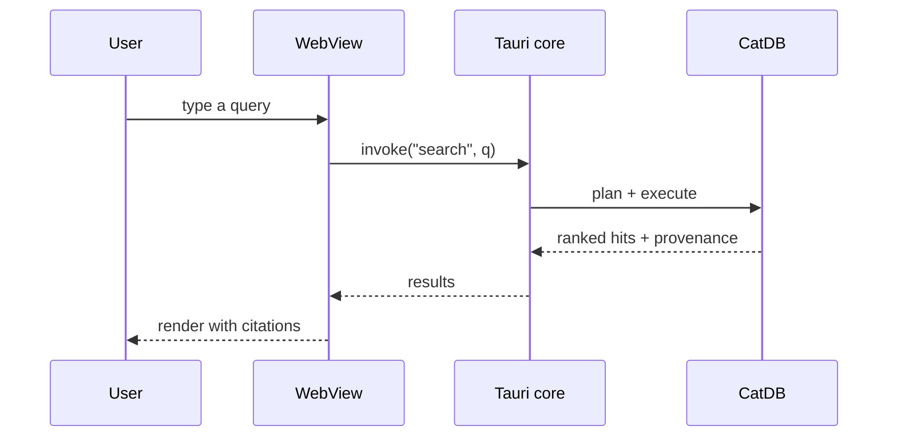

# Mermaid Sequence

How a query flows through MDReader:

```mermaid
sequenceDiagram
    participant U as User
    participant W as WebView
    participant T as Tauri core
    participant C as CatDB
    U->>W: type a query
    W->>T: invoke("search", q)
    T->>C: plan + execute
    C-->>T: ranked hits + provenance
    T-->>W: results
    W-->>U: render with citations
```

See the [flowchart](mermaid-flowchart.md) for the ingest side.
